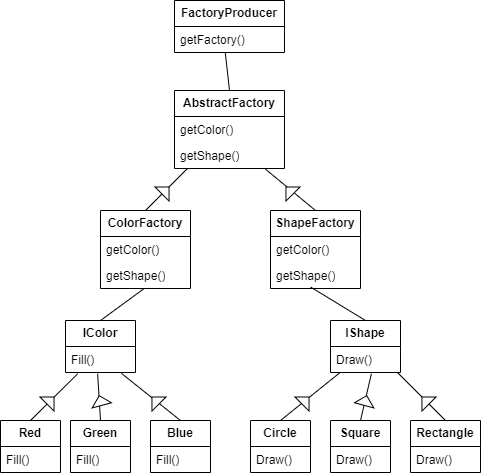

# AbstractFactoryDesignPattern
# Overview
The Abstract Factory Design Pattern is a creational design pattern that provides an interface for creating families of related or dependent objects without specifying their concrete classes. It allows you to create objects with a common theme while ensuring that the created objects are compatible with each other. In your code, you've implemented the Abstract Factory pattern to create shapes and colors with factories that produce objects adhering to the IShape and IColor interfaces.

# Design
1. **Interfaces (IColor and IShape):** 
- These interfaces define the abstract product types that concrete factories will produce. IColor represents the color-related products, and IShape represents the shape-related products.

2. **Concrete Products (Blue, Red, Green, Circle, Square, Rectangle):** 
- These classes implement the IColor and IShape interfaces to provide specific product implementations. For example, Blue is a concrete implementation of the IColor interface, and Circle is a concrete implementation of the IShape interface.

3. **Abstract Factory (AbstractFactory):**
- This abstract class defines abstract factory methods (GetColor and GetShape) for creating products. Concrete factories will provide implementations for these methods.

4. **Concrete Factories (ColorFactory and ShapeFactory):** 
- These classes extend the AbstractFactory and provide concrete implementations for creating products. ColorFactory creates color-related products, and ShapeFactory creates shape-related products.

5. **Factory Producer (FactoryProducer):** 
- This class acts as a factory of factories. It provides a method (GetFactory) to create instances of concrete factories based on the choice provided.

6. **Unit Tests (AbstractFactoryTests):**
- Tests the functionality of the abstract factory pattern.
- Check if the factories create the expected types of shapes and colors.

# Environment
- **Visual Studio 2022:** The integrated development environment (IDE) used for creating, editing, building, and running C# projects.
- **C# Language:** The programming language used for writing the code.
